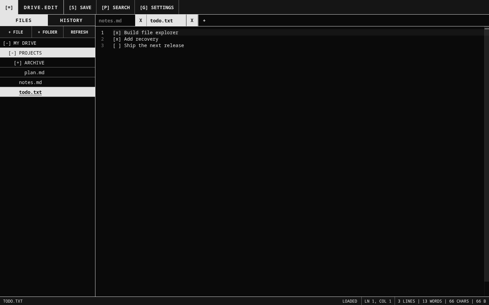
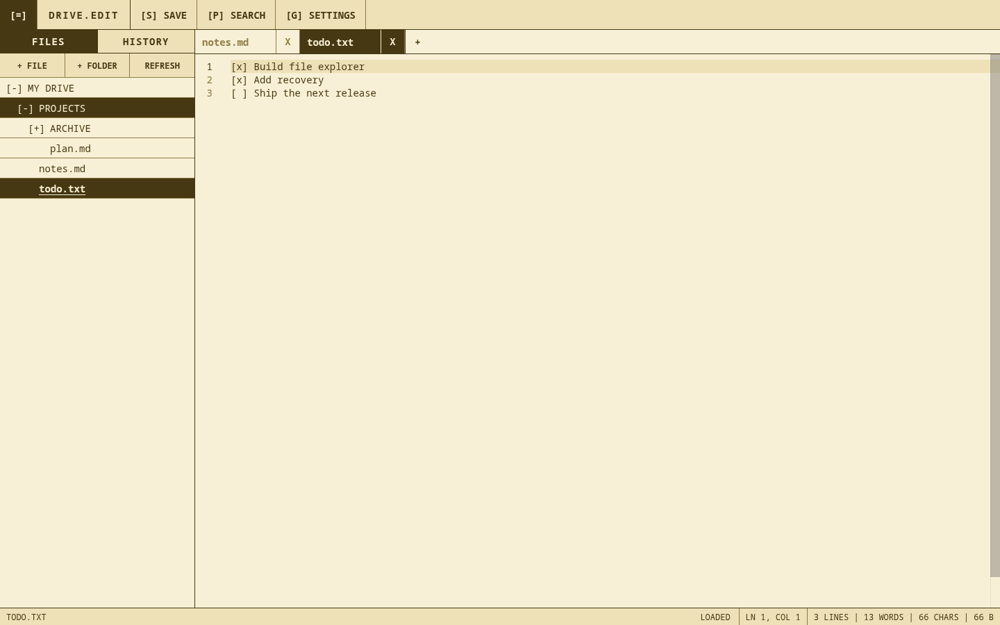

# Drive Edit

A browser-based, monochrome text editor for files stored in Google Drive.

  
  

## Features

- Drive file explorer with inline file and folder creation
- Monaco editor with tabs, loading states, and live file statistics
- Local crash recovery and Drive version-conflict protection
- Drive revision history with read-only previews and confirmed restoration
- Persistent themes, UI fonts, and editor fonts

## Development

```sh
npm install
npm test
docker build -t drive-edit .
docker run --rm -p 8080:8080 drive-edit
```

Run `npm run screenshots` to regenerate the README images with mocked Google
authentication and Drive data.
